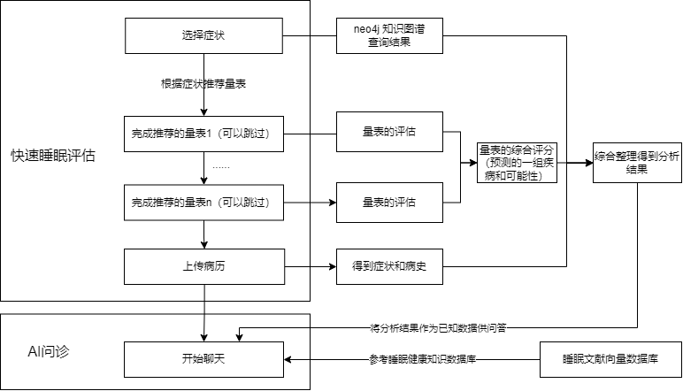
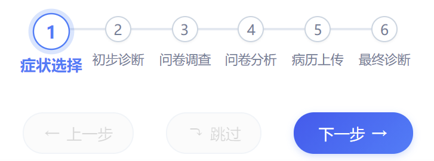
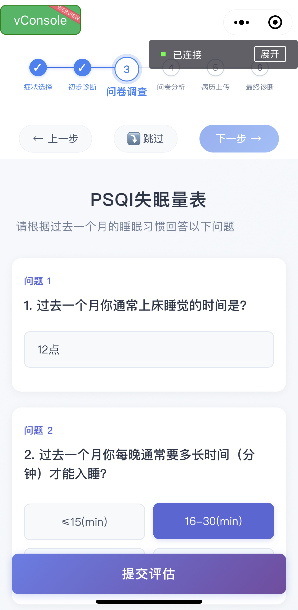
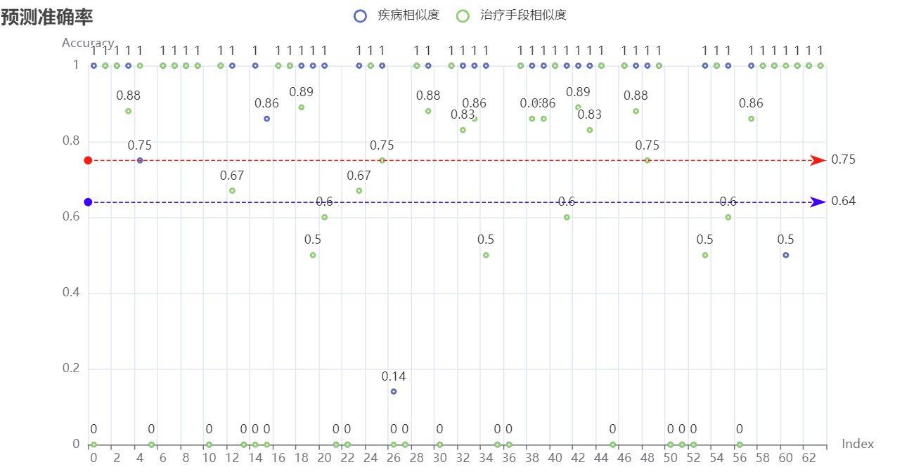

# 基于睡眠健康知识图谱的智能问诊系统设计文档

## 关键词

- 系统形态  
医疗, 睡眠, 知识图谱, 问诊系统;  
- 涉及技术  
数据清洗, 图数据库(neo4j), 向量数据库, 大语言模型(LLM), 提示词工程, 检索增强生成(RAG), 连续问答;
- 系统实现  
小程序/网页(前端), Flask(后端), SurveyJS(量表), RESTFul API.

## 需求分析

在初赛的基础上, 我们根据赛题需求、就诊流程，综合实际使用场景进一步分析需求, 对本系统做了更加精确的定位.

### 用户群体定位

分析《患者资料》可知, 用户群体年龄段等范围广泛, 可能来自社区医院也可能来自养老机构.

### 使用场景

- 基层分诊
  
    在我国医疗资源分布地域不平衡的背景下, 专业的睡眠诊疗中心主要集中在经济发达的大城市，基层医疗机构(比如社区医院)普遍缺乏睡眠专科, 优质医疗资源供不应求, 而智能问诊系统可以为基层医疗机构提供一种低成本、高效率的**辅助工具**. 通过结合睡眠健康知识图谱, 系统能够模拟初步的问诊流程, **收集患者相关信息**, 帮助基层医生快速了解患者的基本状况, 识别可能的高风险患者, 并提供**转诊建议**, 从而在资源有限的情况下提升分诊效率和准确性. 

- 初筛辅助
  
    在睡眠相关疾病的初筛阶段, 普遍采用**量表**(问卷)的形式, 并最终由医生综合病历等各类信息作出诊断意见. 初筛阶段过程相对机械和模式化, 可以借助患者自己的**智能设备**(手机等), 通过智能问诊系统, 生成**初步诊断报告**供**医生**使用, 同时也能帮助患者更早地发现潜在问题. 

- 患者自评
  
    患者可能因为多种原因**未及时就医**. 智能问诊系统可以为患者提供一种简单、便捷的自评手段. 通过回答系统提出的个性化问题, 患者能够快速了解自己的睡眠健康状态, 并获得针对性的建议, 例如调整生活习惯、进一步医学检查或及时就医等. 

### 产品形态

分析以上使用场景, 可以细化系统的形态:

- 交互方式: 触摸点击为主  
考虑到用户群体(患者)可能为老年人等群体, 因此主要交互采用**点击/触摸**的方式; 同时, 对于自评或者有需求的用户, 也提供基于知识库的智能问答系统

- 获取途径: 小程序  
考虑用户获得的便捷性, 系统交互的主要载体采用小程序的形式, 以便可以使用患者自己的智能设备(手机)**扫描二维码**访问

- 使用流程: 引导式、递进式的评估分析(5分钟以内)  
考虑到系统定位主要是**初筛辅助**阶段, 因此系统尽可能**快速**地对患者**症状、量表、病历**等信息作出评估, 并提供**可选**的深入诊断环节  
实际诊断过程是递进式、流程化的, 加之考虑用户交互的便捷, 因此系统模拟实际诊断流程, 通过直观的UI, **递进式**地引导用户完成从基本资料获得到症状分析再到量表评估的全流程, 最后**综合**这些信息提供分析, 供医生和患者参考

## 开发过程

系统为基于睡眠健康**知识图谱**的**智能问诊系统**, 可以分为知识图谱和智能问诊系统构建两大部分

### 知识图谱

#### 功能需求分析

知识图谱在问诊系统中作为支撑问诊的知识库, 有以下基本需求:

- 准确性  
    - 描述  
        知识库要从权威数据构建, 使得问诊系统具备一定可靠性和可解释性  
    - 解决方案  
        我们的系统通过基于文献和真实医疗数据的图数据库实现实现知识图谱的准确性
- 灵活性  
    - 描述  
        知识更迭迅速, 知识库要能够灵活更新、迅速迭代
    - 解决方案  
        我们的系统实现了知识库的流程化并行化高效构建, 支持热更新和查询可视化, 便于在专业人士监管辅助下随时迭代

#### 知识来源分析

本项目的核心数据来源为一系列权威睡眠医学文献, 包括《中国成人失眠诊断与治疗指南》《睡眠医学》《睡眠相关的节律性运动障碍》等专业医学文献; 在补充资料中, 还提供了患者资料、量表结果等信息, 这些资料涵盖了睡眠医学领域的症状描述、诊断标准、治疗方案等大部分知识体系, 可以在构建知识图谱时作为专家知识提供.

#### 原始数据分析

提供的数据主要包括三部分:

1. 医学文献, 如标准教材、诊断标准和指南等

2. 睡眠相关量表及诊断结果

3. 患者资料(包含症状、病史和诊疗计划等信息)

#### 数据预处理

1. 医学文献

    医学文献主要用于知识图谱数据库构建, 因此**不需要精确**结果, 只需要得到保留具备逻辑的分块.  
    在知识图谱构建过程中**分块策略**很重要, 经过测试发现, 实体抽取和关系构建中具备完整语义的上下文相关信息对最后效果影响很大.  
    
    医学文献以PDF文档形式提供, 在尝试过pdfplumber、Unstructured等多种处理框架后, 我们最终选择新兴的**MinerU**框架, 将PDF文档抽取为带层级标题的**markdown**格式, 以便分块时每个块可以保留较**完整的逻辑上下文**.
        
    最后得到如下的markdown文件:
    
    
    
    在得到的文件中, 还存在很多无效信息, 比如成段的参考文献、markdown图片链接、公式等, 这些信息需要移除, 完成后得到预处理后的文献数据集:
    
    ```
    大小       词数                 中文    英文    文件名
    Size      Basic   CN     EN     File 
    ---------------------------------------------------------------------------------------
    15.50 KB  4407     4155   174    	《成年人阻塞性睡眠呼吸暂停低通气综合征筛查：美国预防临床服务指南工作组推荐声明》解读.md
    51.00 KB  13992   13416  432    	女性阻塞性睡眠呼吸暂停诊治专家共识.md
    23.40 KB  6695     6462   89     	绝经相关失眠临床管理中国专家共识.md
    26.13 KB  7486     7291   142    	中国帕金森病睡眠障碍管理专家共识.md
    16.84 KB  3609     3454   88     	多发性硬化合并睡眠障碍研究进展.md
    12.99 KB  3782     3669   68     	睡眠相关的节律性运动障碍的临床特点.md
    28.49 KB  8202     7986   153    	成人阻塞性睡眠呼吸暂停高危人群筛查与管理专家共识.md
    19.42 KB  5843     5567   191    	孤独症谱系障碍儿童睡眠障碍临床实践相关指南解读.md
    1.36 MB   402527 389968 6424   	睡眠医学_14370617.md
    19.53 KB  4020     3763   150    	儿童中枢性睡眠呼吸暂停56例临床分析.md
    45.42 KB  12666   12064  386    	中国发作性睡病诊断与治疗指南（2022版）.md
    40.32 KB  11177    10610  372    	中国不宁腿综合征的诊断与治疗指南（2021版）.md
    33.86 KB  9273     8759   391    	卒中相关睡眠障碍评估与管理中国专家共识.md
    51.21 KB  13376   12482  664    	中国儿童阻塞性睡眠呼吸暂停诊断与治疗指南（2020）.md
    16.93 KB  3799     3674   78     	睡眠相关的节律性运动障碍.md
    32.38 KB  8895     8438   297    	认知功能损害患者睡眠障碍评估和管理的专家共识.md
    33.11 KB  9395     9042   184    	基层医疗机构失眠症诊断和治疗中国专家共识.md
    17.04 KB  4884     4718   113    	特发性过度睡眠：一类不容忽视的睡眠障碍.md
    26.85 KB  7463     7044   260    	中国6岁以下儿童就寝问题和夜醒治疗指南（2023）.md
    14.57 KB  4133     3844   181    	脑卒中伴睡眠期周期性肢体运动患者的睡眠结构研究.md
    57.93 KB  16512   15986  361    	中国成人失眠诊断与治疗指南（2023版） (2).md
    13.71 KB  3874     3635   147    	中国快速眼球运动睡眠期行为障碍诊断与治疗专家共识.md
    12.93 KB  3767     3588   84     	慢性偏头痛住院患者医疗质量评价与改进专家共识.md
    40.17 KB  11383    11060  223    	日间过度思睡临床诊断和治疗专家共识.md
    ---------------------------------------------------------------------------------------
    
    ```

2. 睡眠相关量表及诊断结果

    共有约150组带标签的睡眠量表数据, 主要用于量表分析和疾病推测, 需要得到**精确性**的数据.    
    睡眠相关量表结果也是PDF格式, 对于不同种类量表结果, 框架效果不一, 因此我们综合使用使用pdfplumber、pymupdf等框架针对每一类量表适配, 最终批量处理得到如下的诊断结果(159*104):
    
    
    
    此外, 还得到一组量表定义文件(json), 包含量表的内容和评分标准, 可供后续基于SurveyJS的量表系统使用:
    
    
    
3. 患者资料

    患者资料用于辅助知识图谱数据库构建, **不需要精确**结果.  
    提供的格式为word格式, 因此无需做额外的处理.

#### 实体抽象和关系定义

基于睡眠医学文献的专业知识, 我们适当抽象了系统所需的的知识体系框架, 包含疾病、症状、诊断、治疗(药物非药物)等核心概念以及"症状-疾病"、"疾病-并发症"等重要关系, 然后据此定义了**neo4j知识图谱数据库**的基本实体和关系结构:

```cypher
// 将name作为主键

// 疾病节点
CREATE (:Disease {
    name: String,           // 疾病名称
    code: String,           // 疾病编码
    description: String,    // 疾病描述
    category: String,       // 疾病分类
    severity: String        // 严重程度
});

// 症状节点
CREATE (:Symptom {
    name: String,           // 症状名称
    description: String,    // 症状描述
    severity: String,       // 严重程度
    frequency: String       // 发生频率
});

// 检查项目节点
CREATE (:Examination {
    name: String,           // 检查名称
    description: String,    // 检查描述
    method: String,         // 检查方法
    requirement: String     // 检查要求
});

// 治疗方案节点
// 药物治疗节点
CREATE (:DrugTreatment {
    name: String,           // 药物名称
    description: String,    // 药物描述
    dosage: String,        // 用药剂量
    frequency: String,     // 用药频率 
    duration: String,      // 疗程
    route: String,         // 给药途径
    contraindication: String, // 禁忌症
});

// 非药物治疗节点  
CREATE (:NonDrugTreatment {
    name: String,           // 治疗名称
    description: String,    // 治疗描述
    duration: String,       // 持续时间
    frequency: String,      // 治疗频率
    contraindication: String, // 禁忌症
    equipment: String,      // 所需设备
});

// 用于提取《患者资料》
// 病史或者风险因素节点(核心关系)
CREATE (:RiskFactor {
    name: String,           // 因素名称
    type: String,           // 候选: [现病史, 既往史, 家族史, 其他风险]
    description: String,    // 描述
    impact_level: String    // 影响程度
});

// 并发症节点
CREATE (:Complication {
    name: String,           // 并发症名称
    description: String,    // 描述
    severity: String        // 严重程度
});

// 定义关系类型
// 症状-疾病关系(核心关系)
CREATE (:Symptom)-[:INDICATES {
    confidence: Float,      // 置信度
    frequency: String,      // 发生频率
    severity: String        // 严重程度
}]->(:Disease);

// 疾病-检查关系(核心关系)
CREATE (:Disease)-[:REQUIRES_EXAM {
    priority: String,       // 优先级
    mandatory: Boolean      // 是否必需
}]->(:Examination);

// 疾病-治疗关系(核心关系)
CREATE (:Disease)-[:TREATED_BY {
    effectiveness: Float,   // 有效性
    priority: String,       // 优先级
    stage: String          // 治疗阶段
}]->(:Treatment);

// 疾病-并发症关系
CREATE (:Disease)-[:MAY_CAUSE {
    probability: Float,     // 发生概率
    timeframe: String      // 时间框架
}]->(:Complication);

// 疾病-风险或病史因素关系
CREATE (:Disease)-[:INFLUENCED_BY {
    impact_level: String,   // 影响程度
    evidence_level: String  // 证据等级
}]->(:RiskFactor);
```

#### 实体抽取与关系构建

完成本体设计后, 我们利用**大语言模型**的自然语言处理能力, 基于**提示词工程**根据预定义好的实体关系定义, 从预处理后的分块医学文献中抽取实体并构建关系关系

比如, 在《中国帕金森病睡眠障碍管理专家共识》中，对于以下文本:


经过抽取得到的症状实体、疾病实体和"症状-疾病"关系如下:

```cypher
MERGE (d1:Disease {name: "帕金森病"})
MERGE (d2:Symptom {name: "失眠", description: "一种睡眠障碍类型，发生率为30.0%至86.8%", severity: "中", frequency: "常见"})
MERGE (d3:Symptom {name: "日间过度思睡", description: "在日间应该维持清醒的主要时段难以持续保持清醒和警觉状态", severity: "中", frequency: "频繁"})
MERGE (d4:Symptom {name: "快速眼球运动睡眠期行为障碍", description: "REM睡眠期间伴随梦境及肢体活动的睡眠疾病", severity: "中", frequency: "较常见"})
MERGE (d5:Symptom {name: "不宁腿综合征", description: "一种常见的神经系统感觉运动障碍", severity: "中", frequency: "常见"})
MERGE (d6:Symptom {name: "睡眠呼吸障碍", description: "睡眠中呼吸异常的疾病", severity: "高", frequency: "常见"})
MERGE (d1)-[:INDICATES { frequency: "高", severity: "重要"}]->(d2)
MERGE (d1)-[:INDICATES { frequency: "中", severity: "中等"}]->(d3)
MERGE (d1)-[:INDICATES { frequency: "常见", severity: "较重"}]->(d4)
MERGE (d1)-[:INDICATES { frequency: "较常见", severity: "中"}]->(d5)
MERGE (d1)-[:INDICATES { frequency: "高", severity: "严重"}]->(d6)
```

从以下文本进而得到药物和非药物治疗实体以及"疾病-治疗"关系:


```cypher
MERGE (t1:NonDrugTreatment {name: "失眠认知行为治疗", description: "通过改变思维模式和行为来改善睡眠问题", duration: "长期", frequency: "需要时", contraindication: "无", equipment: "无"})
MERGE (t2:NonDrugTreatment {name: "强光治疗", description: "通过强光照射改善睡眠质量", duration: "短期", frequency: "根据需要", contraindication: "无", equipment: "强光灯"})
MERGE (t3:DrugTreatment {name: "复方左旋多巴缓释剂", description: "用于优化多巴胺能治疗", dosage: "根据医生建议", frequency: "睡前", duration: "短期", route: "口服", contraindication: "严重脑功能障碍"})
MERGE (d1)-[:TREATED_BY {priority: "高", stage: "初始治疗"}]->(t1)
MERGE (d1)-[:TREATED_BY {priority: "中", stage: "医师指导下治疗"}]->(t2)
MERGE (d1)-[:TREATED_BY {priority: "高", stage: "个体化治疗"}]->(t3)
```

经过人工核验, 可以认为抽取效果较好, 达到可用水平.

#### 查询优化

在实际知识库中, 可能有大量节点; 考虑到实际使用场景, 不同实体可以视为依照名字区分, 因此可以构建相应的约束和索引, 以便规范化实体关系以及加速查询:

```cypher
// 索引
CREATE CONSTRAINT disease_name IF NOT EXISTS
FOR (d:Disease) REQUIRE d.name IS UNIQUE;
CREATE CONSTRAINT treatment_name IF NOT EXISTS

// 唯一性约束
CREATE INDEX disease_index IF NOT EXISTS
FOR (d:Disease) ON (d.name);

// 省略
```

#### 关系标准化

在实际构建过程中, 我们发现提取出来的实体和关系容易出现重定义和冲突问题, 这是因为每个块的预处理和最终导入都是独立的. 实际的"学习"过程应该是能够增量更, 即: 后续的"知识"要能够进行"查漏补缺", 而非冲突.

因此, 我们加入了语句标准化的过程, 将抽取得到的具备一定模式的cypher语句解析后转换为支持增量更新的版本. 比如, [**实体抽取与关系构建**](#实体抽取与关系构建) 一节中的语句转换后得到如下结果:

```cypher
MERGE (n:NonDrugTreatment {name: '失眠认知行为治疗'})
SET 
    n.description = coalesce(n.description, '通过改变思维模式和行为来改善睡眠问题'),
    n.duration = coalesce(n.duration, '长期'),
    n.frequency = coalesce(n.frequency, '需要时'),
    n.contraindication = coalesce(n.contraindication, '无'),
    n.equipment = coalesce(n.equipment, '无');

MERGE (n:NonDrugTreatment {name: '强光治疗'})
SET 
    n.description = coalesce(n.description, '通过强光照射改善睡眠质量'),
    n.duration = coalesce(n.duration, '短期'),
    n.frequency = coalesce(n.frequency, '根据需要'),
    n.contraindication = coalesce(n.contraindication, '无'),
    n.equipment = coalesce(n.equipment, '强光灯');

MERGE (n:DrugTreatment {name: '复方左旋多巴缓释剂'})
SET 
    n.description = coalesce(n.description, '用于优化多巴胺能治疗'),
    n.dosage = coalesce(n.dosage, '根据医生建议'),
    n.frequency = coalesce(n.frequency, '睡前'),
    n.duration = coalesce(n.duration, '短期'),
    n.route = coalesce(n.route, '口服'),
    n.contraindication = coalesce(n.contraindication, '严重脑功能障碍');
```

#### 流程化构建

考虑到知识库迭代和更新的时效性, 我们实现了从预处理阶段到标准化再到数据库导入全过程流程化的构建方式:

- 专业文献预处理
- 知识库分块
- 关系抽取
- 关系标准化
- 数据库导入和动态更新

#### 知识图谱展示

最终我们得到构建好的包含约4000个实体, 500组关系的知识图谱.


局部细节


查询示例


### 问诊系统

#### 功能需求分析

根据需求, 问诊系统是直接面向最终用户的, 因此要提供友好的交互界面和清晰的引导; 同时, 问诊系统需要依赖知识图谱为用户提供可靠的服务.

#### 使用流程分析

根据细化后的产品定位和需求分析, 可以基本确定系统的使用基本流程

- 扫描二维码进入小程序
- 点击选择症状信息, 并获得基于知识图谱的症状分析
- (可选)通过点击完成基于症状进行推荐的量表, 并获得单个量表的结果和量表综合分析
- (可选)拍照上传病历, 并获得病历分析结果
- 获得基于睡眠健康医疗知识图谱、量表、病历等信息的综合分析结果
- (可选)与基于知识图谱的智能问诊助手进行问答, 获取相应建议等

如图:


#### 架构设计

本系统采用前后端分离的架构设计, 前端使用微信小程序开发, 为用户提供轻量级、便捷的访问方式. 后端采用分层架构, 包括数据层、服务层和API层. 

- 数据层  
    主要由Neo4j图数据库存储睡眠医学知识图谱, 使用ElasticSearch负责专业文献知识检索; 
- 服务层  
    包含基于图谱的查询服务、量表分析服务、病历分析服务和AI问诊服务等核心功能模块; 
- API层  
    使用Flask框架提供统一的网关入口, 处理微信小程序的认证和请求路由. 


结合用户使用流程, 得到系统数据流图如下:



#### 功能设计

系统分为快速睡眠评估和AI问诊两大核心功能.

##### 快速睡眠评估

快速睡眠评估为系统核心功能, 将模拟实际问诊过程, 引导用户完成一整套评估流程, 并提供分析结果. 

1. 引导式流程条

    为了让用户直观地感受我们的评估流程, 更好地引导用户完成诊断, 我们设置了引导式流程条, 用户可以在清晰明了的视觉指引下便捷地推进诊断流程.

    
    
2. 症状选择

    目前, 考虑用户交互的便捷性, 我们构建的基于知识图谱的问诊系统主要采用基于点击选择的方式进行查询. 我们将症状依据类别进行分组, 将症状信息和对应的推荐量表以卡片的形式呈现给用户.  
    
    
    
3. 症状分析和量表推荐

    在完成选择后, 系统基于neo4j知识图谱对用户症状进行查询、匹配和分析, 得到可能疾病和对应的药物和非药物治疗推荐.  
    在实际睡眠医疗中, 不同的量表用于不同的类型疾病的诊断. 我们根据用户选择的症状为其推荐相应的量表.

    

4. 量表填写(可选)
   
    根据症状, 推荐进行AISI、PSQI等量表测试.  
    用户可以填写量表并提交, 也可以选择跳过.  

    

    
    
5. 量表评估

    提交后会依据填写结果得到直观的问卷分析; 在填写多个问卷后, 会基于算法根据填写的多个问卷综合分析, 得到可能的疾病.

    
    
6. 病历上传和分析(可选)
   
    用户可以选择上传病历, 以便综合病史等信息进行疾病分析.

    
    
    实际病历中仅有症状和病史等信息, 因此重点针对病历中的这些信息提取:
    
    
    
    

7. 综合分析

    最终的综合分析包含从症状分析到检查建议的多维度评估总览.

    
    
    
    
    
    
    
    
    

##### AI问诊

AI问诊作用在于为用户提供友好灵活的交互接口. 系统基于langchain实现**连续对话**功能, 基于[**快速睡眠评估**](#快速睡眠评估)的分析结果和**睡眠知识向量数据库**实现专业知识的检索增强问答. 用户可以进一步查询评估结果, 包括知识图谱查询结果分析、量表分析和病历分析等, 并获取AI问诊助手基于**实时**睡眠数据库的建议.

1. 基于评估结果的分析
   
    对话能够根据知识图谱查询和量表分析结果进行:
    
    询问"我有哪些症状?"  
    与之前的查询结果相符.
    
    
    
    询问"我有哪些病史?其中哪些可能与我的睡眠问题有关?"  
    与之前的查询结果相符.  
    
    
    
    询问"我应该去哪些科室检查?"
    与之前的查询结果相符.  
    
    
    
    询问"我应该采用哪些药物治疗和非药物治疗?"
    与之前的查询结果相符.  
    
    
    
    询问"我应该进行哪些检查来评估我的睡眠状况?"
    与之前的查询结果相符.  
    
    

2. 问题推荐
   
    考虑到用户交互的便捷性, 系统每次问答后都会根据用户的最新意图和历史进行三条用户可能询问的问题进行推荐, 用户可以全程不用输入文本.

3. 流式传输
   
    考虑交互的时效性, 系统的回答和问题推荐都支持流式传输.
    
4. 检索增强问答
   
    询问"我如何改善我的睡眠环境和卫生习惯?"
    
    对于这类不包含在neo4j知识图谱中的知识, 通过实时查询**睡眠知识数据库**可以获得相应的知识增强问答.
    
    
    
5. 连续对话

    询问"现在, 我是谁?"

    系统基于langchain实现了连续对话, 并对上下文历史窗口依据关键词和重要程度进行适当筛选、压缩, 在经过上面的大约10次问答后依然能够"记住"用户为Bobby.
    
    

## 测试分析

基于知识图谱的诊断系统核心作用是根据输入的一组症状得到疾病和治疗手段, 将提供的64个患者资料规范化后提取出每一组数据的"症状-疾病-治疗手段", 作为测试样本; 考虑到医学名词的专业性和自然语言的模糊性, 测试时将每组数据的诊断结果(疾病和治疗手段)的文本分别向量化, 然后与正确的诊断结果向量化文本进行相似度匹配, 得到结果如下:




考虑到样本本身存在一定缺失值, 可以认为基于知识图谱的问诊系统准确率达到可用水平.

## 技术难点

### 关系抽取准确性

- 难点描述
  
    在处理睡眠医学文献时, 实体识别面临着独特的挑战. 医学术语表达具有高度的专业性和复杂性, 同一概念可能存在多种表达方式, 如"入睡困难"和"睡眠维持障碍"等. 在抽取生成数据库时, 提取出来的实体可能包含很多同义词, 导致实际使用时查询效果波动较大.

- 解决方案

    在提示词工程的实体关系抽取过程中, 通过多轮构建, 逐步细化, 辅助以基于文本相似度的实体合并来实现.
    
    比如, 在初步构建的知识图谱中, 查询得到如下症状-关联疾病组合:
    
    ```json
    [
        {"s.name": "失眠", "COUNT(d)": 213},
        {"s.name": "入睡困难", "COUNT(d)": 112},
        {"s.name": "早醒", "COUNT(d)": 112},
        {"s.name": "日间过度思睡", "COUNT(d)": 85},
        {"s.name": "睡眠障碍", "COUNT(d)": 83},
        {"s.name": "过度思睡", "COUNT(d)": 48},
        {"s.name": "习惯性打鼾", "COUNT(d)": 44},
        {"s.name": "白天精神差", "COUNT(d)": 31},
        {"s.name": "夜间入睡困难", "COUNT(d)": 31},
        {"s.name": "反复觉醒", "COUNT(d)": 31},
        {"s.name": "头痛头晕", "COUNT(d)": 31},
        {"s.name": "乏力", "COUNT(d)": 31},
        {"s.name": "日间思睡", "COUNT(d)": 16},
        {"s.name": "醒后困倦", "COUNT(d)": 12},
        {"s.name": "情绪低落", "COUNT(d)": 9},
        {"s.name": "紧张不安", "COUNT(d)": 9},
        {"s.name": "情绪紧张", "COUNT(d)": 9},
        {"s.name": "烦躁", "COUNT(d)": 9},
        {"s.name": "心率减慢", "COUNT(d)": 6},
        {"s.name": "鼻塞", "COUNT(d)": 4},
        {"s.name": "做噩梦", "COUNT(d)": 3},
        {"s.name": "夜间手舞足蹈", "COUNT(d)": 2},
        {"s.name": "打鼾", "COUNT(d)": 2},
        {"s.name": "睡眠扰乱", "COUNT(d)": 2}
    ]
    ```
    
    其中"习惯性打鼾"和"打鼾"存在同义, 经计算, 其相似度为0.9260
    
    ```python
    from sentence_transformers import SentenceTransformer
    model = SentenceTransformer('paraphrase-MiniLM-L6-v2')
    sim = model.similarity(model.encode("习惯性打鼾"), model.encode("打鼾"))
    ```
    
    对于这类同一实体, 采取合并的策略.
    
### 知识一致性维护

- 难点描述

    由于知识来源的多样性, 不同文献对同一医学概念可能有不同的描述和理解深度, 这导致知识合并时可能产生冲突. 
    
- 解决方案
  
    我们采用[**关系标准化**](#关系标准化)章节的方法, 对抽取得到的neo4j cypher语句进行关系标准化处理后实现关系增量更新

### 知识图谱更新维护

- 难点描述

知识的动态演进性对知识图谱的更新维护提出了严峻挑战, 要求系统能够高效处理知识的扩展、更迭.

- 解决方案

我们将预处理阶段的过程提取为标准化流水线, 通过代码实现由PDF文献到neo4j知识图谱端到端的知识库构建流程
    


